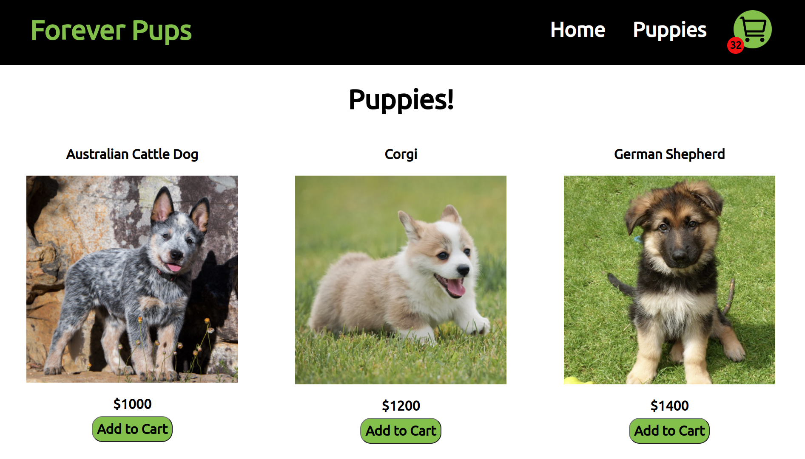

# Shopping Cart

Project from [The Odin Project](https://www.theodinproject.com/)

### Technologies Used

React

CSS3

Git

### Overview

This is a little react website showing off a working shopping cart component! There is a home and product page linked through react routing. In the product page users can add puppies to the cart. The cart can be accessed by clicking the cart icon in the nav bar. Clicking off the cart will close the cart. In the cart component, users can see the quantity of items in the cart and can add or delete items within it. The total price of all items is displayed.

Future improvements include a more visually appealing UI, a checkout page, and actual integration to a forever puppy development lab to bring the site use to the world.

Thank You for taking the time to look at my work!
